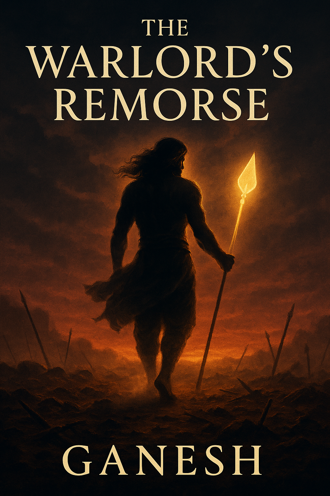

# The Warlord's Remorse

  

## Synopsis

Come. Sit with me awhile. 

They called him Commander, General, God of War. But long before the hymns and the weapons, before even the title Velavan curled on worshippers’ tongues, he was just… a boy. A boy who killed too young, led too long, and never once asked why. Until the war ended. And a remorseful question made him speak up.

This is not a tale sung in temples. Not yet. This is the other story—the one the gods whisper about but never confess. Of how Murugan, the divine commander of the Deva legions, laid down his weapon, not in defeat, but in doubt.

Yes. Doubt. About dharma. About justice. About the endless, grinding wheel of bloodshed dressed up as divine duty.

He walked away, child. From his army. His family. His people. From the heavens that had been his home for millennia. From the very war he once carved into the bones of time. He chose exile — not as punishment, but as penance. And where did he go? We don't know. Not for sure. But only one land had ever called him son. And I think he went there.

He left behind his father’s silence, his mother’s gaze, his brother’s knowing sadness. And the world, oh yes… the world noticed. Even the Asuras stirred. For if the warlord had retired, what stood between them and another age of fire?

But this isn’t their story. It’s his. And yours.

Because what if I told you that exile wasn’t the end? That deep in the forests of the Nilgiris, among hills that bend and trees that bow, a new fate was written — not for gods, but for mortals? For mortals, not yet born when he vanished, but destined to rise where he once stood.

So come. The tale begins not in battle, but in quiet. Not in heaven, but here. With you.
Yes, you.

Now hush. The peacocks are crying again.

And when they do… it means he is remembering.

## Table of Contents

#### Act 1
- [Prologue](./chapters/act_1/ch1.md)

### Act 2
- [Chapter 2](./chapters/act_2/ch2.md)
- [Chapter 3](./chapters/act_2/ch3.md)
